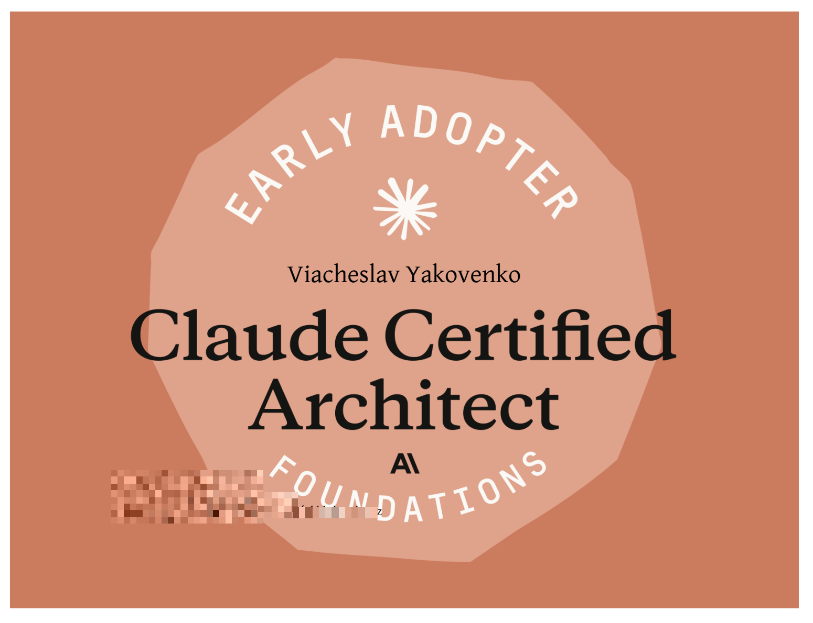

# Claude Certified Architect



```
┌──────────────────────────────────────────────────────────────────────┐
│                          CURRICULUM                                  │
├──────────────────────────────────────────────────────────────────────┤
│  Domain 1 · Agent Architecture & Orchestration              27%      │
│  Domain 2 · Tool Design & MCP Integration                            │
│  Domain 3 · Claude Code Configuration & Workflows                    │
│  Domain 4 · Prompt Engineering & Structured Output                   │
│  Domain 5 · Context Management & Reliability                         │
└──────────────────────────────────────────────────────────────────────┘
```

<pre>
<b>Domain 1 · Agent Architecture &amp; Orchestration</b>  27%
├── <a href="lectures/L1.1_agent_loop/README.md">L1.1 · Agent Loop</a>  ~3h
├── L1.2 · Multi-Agent Orchestration  ~5h
└── L1.3 · Hooks &amp; Decomposition  ~4h

<b>Domain 2 · Tool Design &amp; MCP Integration</b>
├── L2.1 · Tool Design  ~4h
└── L2.2 · MCP Integration  ~6h

<b>Domain 3 · Claude Code Configuration &amp; Workflows</b>
├── L3.1 · Claude Code Configuration  ~4h
└── L3.2 · Plan Mode &amp; CI/CD  ~3h

<b>Domain 4 · Prompt Engineering &amp; Structured Output</b>
├── L4.1 · Prompt Engineering  ~4h
├── L4.2 · Structured Output  ~5h
├── L4.3 · Batch Processing  ~3h
└── L4.4 · Multi-Pass Review  ~4h

<b>Domain 5 · Context Management &amp; Reliability</b>
└── L5.1 · Context Reliability  ~4h

<b>Exam Preparation &amp; Review</b>
├── LR1 · Exam Traps  ~6h
└── LR2 · Mock 3 Concepts  ~6h
</pre>

---

[Full course details →](lectures/README.md)
